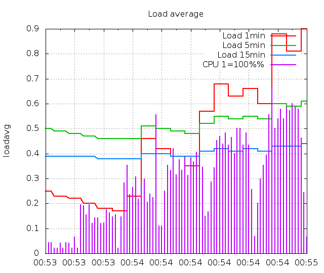
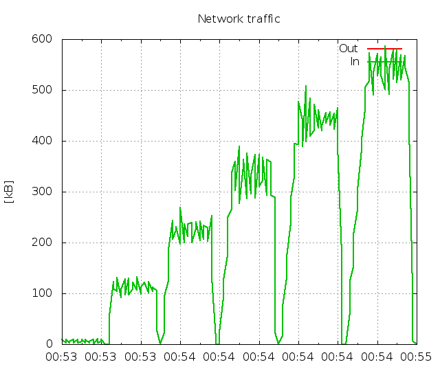
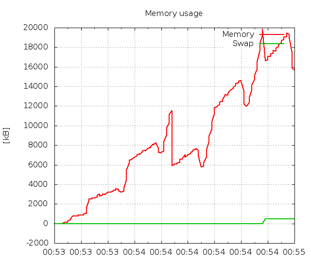
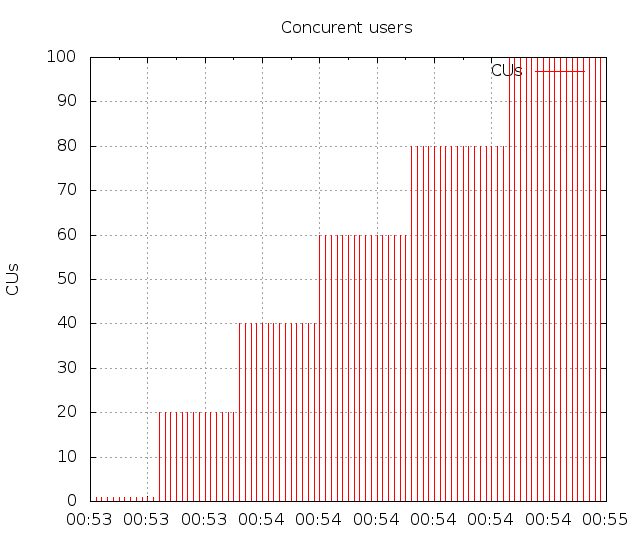

======================
FunkLoad_ bench report
======================

:date: 2015-11-22 00:53:30
:abstract: Try to test all xml rpc method
           Bench result of ``Credential.test_credential``: 
           Check all credentiald methods

.. _FunkLoad: http://funkload.nuxeo.org/
.. sectnum::    :depth: 2
.. contents:: Table of contents
.. |APDEXT| replace:: \ :sub:`1.5`

Bench configuration
-------------------

* Launched: 2015-11-22 00:53:30
* From: localhost.localdomain
* Test: ``test_Credential.py Credential.test_credential``
* Target server: http://localhost:44401/
* Cycles of concurrent users: [1, 20, 40, 60, 80, 100]
* Cycle duration: 10s
* Sleeptime between requests: from 0.1s to 0.2s
* Sleeptime between test cases: 0.5s
* Startup delay between threads: 0.05s
* Apdex: |APDEXT|
* FunkLoad_ version: 1.17.1

Bench content
-------------

The test ``Credential.test_credential`` contains: 

* 0 pages
* 0 redirects
* 0 links
* 0 images
* 5 XML-RPC calls

The bench contains:

* 2347 tests
* 11729 pages
* 11729 requests

Test stats
----------

The number of Successful **Tests** Per Second (STPS) over Concurrent Users (CUs).

 .. image:: tests.png

 ================== ================== ================== ================== ==================
                CUs               STPS              TOTAL            SUCCESS              ERROR
 ================== ================== ================== ================== ==================
                  1              0.800                  8                  8             0.00%
                 20             15.700                157                157             0.00%
                 40             31.800                318                318             0.00%
                 60             47.700                477                477             0.00%
                 80             62.500                625                625             0.00%
                100             76.200                762                762             0.00%
 ================== ================== ================== ================== ==================

Page stats
----------

The number of Successful **Pages** Per Second (SPPS) over Concurrent Users (CUs).
Note: an XML-RPC call counts as a page.

 .. image:: pages_spps.png
 .. image:: pages.png

 ================== ================== ================== ================== ================== ================== ================== ================== ================== ================== ================== ================== ================== ================== ==================
                CUs             Apdex*             Rating               SPPS            maxSPPS              TOTAL            SUCCESS              ERROR                MIN                AVG                MAX                P10                MED                P90                P95
 ================== ================== ================== ================== ================== ================== ================== ================== ================== ================== ================== ================== ================== ================== ==================
                  1              1.000          Excellent              4.000              5.000                 40                 40             0.00%              0.001              0.002              0.004              0.001              0.002              0.002              0.002
                 20              1.000          Excellent             79.100             84.000                791                791             0.00%              0.001              0.002              0.012              0.001              0.001              0.002              0.003
                 40              1.000          Excellent            158.800            165.000               1588               1588             0.00%              0.001              0.002              0.201              0.001              0.001              0.002              0.003
                 60              1.000          Excellent            235.900            256.000               2359               2359             0.00%              0.001              0.002              0.015              0.001              0.001              0.003              0.005
                 80              1.000          Excellent            312.900            324.000               3129               3129             0.00%              0.001              0.004              1.004              0.001              0.001              0.004              0.008
                100              1.000          Excellent            382.200            398.000               3822               3822             0.00%              0.001              0.010              1.013              0.001              0.002              0.005              0.009
 ================== ================== ================== ================== ================== ================== ================== ================== ================== ================== ================== ================== ================== ================== ==================

 \* Apdex |APDEXT|

Request stats
-------------

The number of **Requests** Per Second (RPS) (successful or not) over Concurrent Users (CUs).

 .. image:: requests_rps.png
 .. image:: requests.png
 .. image:: time_rps.png

 ================== ================== ================== ================== ================== ================== ================== ================== ================== ================== ================== ================== ================== ================== ==================
                CUs             Apdex*            Rating*                RPS             maxRPS              TOTAL            SUCCESS              ERROR                MIN                AVG                MAX                P10                MED                P90                P95
 ================== ================== ================== ================== ================== ================== ================== ================== ================== ================== ================== ================== ================== ================== ==================
                  1              1.000          Excellent              4.000              5.000                 40                 40             0.00%              0.001              0.002              0.004              0.001              0.002              0.002              0.002
                 20              1.000          Excellent             79.100             84.000                791                791             0.00%              0.001              0.002              0.012              0.001              0.001              0.002              0.003
                 40              1.000          Excellent            158.800            165.000               1588               1588             0.00%              0.001              0.002              0.201              0.001              0.001              0.002              0.003
                 60              1.000          Excellent            235.900            256.000               2359               2359             0.00%              0.001              0.002              0.015              0.001              0.001              0.003              0.005
                 80              1.000          Excellent            312.900            324.000               3129               3129             0.00%              0.001              0.004              1.004              0.001              0.001              0.004              0.008
                100              1.000          Excellent            382.200            398.000               3822               3822             0.00%              0.001              0.010              1.013              0.001              0.002              0.005              0.009
 ================== ================== ================== ================== ================== ================== ================== ================== ================== ================== ================== ================== ================== ================== ==================

 \* Apdex |APDEXT|

Slowest requests
----------------

The 5 slowest average response time during the best cycle with **100** CUs:

* In page 003, Apdex rating: Excellent, avg response time: 0.01s, xmlrpc: ``http://localhost:44401/#listGroups``
  `list groups from the group file`
* In page 004, Apdex rating: Excellent, avg response time: 0.01s, xmlrpc: ``http://localhost:44401/#listCredentials``
  `list all credential of the file`
* In page 001, Apdex rating: Excellent, avg response time: 0.01s, xmlrpc: ``http://localhost:44401/#getStatus``
  `Check getStatus`
* In page 002, Apdex rating: Excellent, avg response time: 0.01s, xmlrpc: ``http://localhost:44401/#getCredential``
  `Get a credential from a file`
* In page 005, Apdex rating: Excellent, avg response time: 0.01s, xmlrpc: ``http://localhost:44401/#listCredentials``
  `list credentials of group AdminZope`

Monitored hosts
---------------

localhost: The benching and benched machine
~~~~~~~~~~~~~~~~~~~~~~~~~~~~~~~~~~~~~~~~~~~

**MonitorCPU**

**MonitorNetwork**

**MonitorMemFree**

**MonitorCUs**

Page detail stats
-----------------

PAGE 001: Check getStatus
~~~~~~~~~~~~~~~~~~~~~~~~~

* Req: 001, xmlrpc, url ``http://localhost:44401/#getStatus``

     .. image:: request_001.001.png

     ================== ================== ================== ================== ================== ================== ================== ================== ================== ================== ================== ================== ==================
                    CUs             Apdex*             Rating              TOTAL            SUCCESS              ERROR                MIN                AVG                MAX                P10                MED                P90                P95
     ================== ================== ================== ================== ================== ================== ================== ================== ================== ================== ================== ================== ==================
                      1              1.000          Excellent                  8                  8             0.00%              0.001              0.002              0.004              0.001              0.002              0.004              0.004
                     20              1.000          Excellent                160                160             0.00%              0.001              0.001              0.003              0.001              0.001              0.002              0.002
                     40              1.000          Excellent                319                319             0.00%              0.001              0.002              0.201              0.001              0.001              0.002              0.003
                     60              1.000          Excellent                474                474             0.00%              0.001              0.002              0.013              0.001              0.001              0.003              0.003
                     80              1.000          Excellent                621                621             0.00%              0.001              0.006              1.004              0.001              0.001              0.004              0.008
                    100              1.000          Excellent                763                763             0.00%              0.001              0.011              1.013              0.001              0.001              0.005              0.009
     ================== ================== ================== ================== ================== ================== ================== ================== ================== ================== ================== ================== ==================

     \* Apdex |APDEXT|

PAGE 002: Get a credential from a file
~~~~~~~~~~~~~~~~~~~~~~~~~~~~~~~~~~~~~~

* Req: 001, xmlrpc, url ``http://localhost:44401/#getCredential``

     .. image:: request_002.001.png

     ================== ================== ================== ================== ================== ================== ================== ================== ================== ================== ================== ================== ==================
                    CUs             Apdex*             Rating              TOTAL            SUCCESS              ERROR                MIN                AVG                MAX                P10                MED                P90                P95
     ================== ================== ================== ================== ================== ================== ================== ================== ================== ================== ================== ================== ==================
                      1              1.000          Excellent                  8                  8             0.00%              0.001              0.001              0.002              0.001              0.001              0.002              0.002
                     20              1.000          Excellent                157                157             0.00%              0.001              0.002              0.010              0.001              0.001              0.003              0.003
                     40              1.000          Excellent                317                317             0.00%              0.001              0.002              0.012              0.001              0.001              0.002              0.003
                     60              1.000          Excellent                470                470             0.00%              0.001              0.002              0.014              0.001              0.001              0.003              0.004
                     80              1.000          Excellent                623                623             0.00%              0.001              0.003              0.208              0.001              0.001              0.003              0.006
                    100              1.000          Excellent                758                758             0.00%              0.001              0.007              1.004              0.001              0.001              0.005              0.009
     ================== ================== ================== ================== ================== ================== ================== ================== ================== ================== ================== ================== ==================

     \* Apdex |APDEXT|

PAGE 003: list groups from the group file
~~~~~~~~~~~~~~~~~~~~~~~~~~~~~~~~~~~~~~~~~

* Req: 001, xmlrpc, url ``http://localhost:44401/#listGroups``

     .. image:: request_003.001.png

     ================== ================== ================== ================== ================== ================== ================== ================== ================== ================== ================== ================== ==================
                    CUs             Apdex*             Rating              TOTAL            SUCCESS              ERROR                MIN                AVG                MAX                P10                MED                P90                P95
     ================== ================== ================== ================== ================== ================== ================== ================== ================== ================== ================== ================== ==================
                      1              1.000          Excellent                  8                  8             0.00%              0.001              0.001              0.002              0.001              0.001              0.002              0.002
                     20              1.000          Excellent                158                158             0.00%              0.001              0.002              0.012              0.001              0.001              0.002              0.003
                     40              1.000          Excellent                318                318             0.00%              0.001              0.002              0.011              0.001              0.001              0.002              0.003
                     60              1.000          Excellent                467                467             0.00%              0.001              0.002              0.013              0.001              0.001              0.003              0.006
                     80              1.000          Excellent                623                623             0.00%              0.001              0.004              1.002              0.001              0.001              0.004              0.007
                    100              1.000          Excellent                766                766             0.00%              0.001              0.013              1.007              0.001              0.001              0.005              0.009
     ================== ================== ================== ================== ================== ================== ================== ================== ================== ================== ================== ================== ==================

     \* Apdex |APDEXT|

PAGE 004: list all credential of the file
~~~~~~~~~~~~~~~~~~~~~~~~~~~~~~~~~~~~~~~~~

* Req: 001, xmlrpc, url ``http://localhost:44401/#listCredentials``

     .. image:: request_004.001.png

     ================== ================== ================== ================== ================== ================== ================== ================== ================== ================== ================== ================== ==================
                    CUs             Apdex*             Rating              TOTAL            SUCCESS              ERROR                MIN                AVG                MAX                P10                MED                P90                P95
     ================== ================== ================== ================== ================== ================== ================== ================== ================== ================== ================== ================== ==================
                      1              1.000          Excellent                  8                  8             0.00%              0.002              0.002              0.002              0.002              0.002              0.002              0.002
                     20              1.000          Excellent                157                157             0.00%              0.001              0.002              0.005              0.001              0.002              0.002              0.002
                     40              1.000          Excellent                316                316             0.00%              0.001              0.002              0.012              0.001              0.002              0.002              0.003
                     60              1.000          Excellent                472                472             0.00%              0.001              0.002              0.012              0.001              0.002              0.003              0.005
                     80              1.000          Excellent                628                628             0.00%              0.001              0.002              0.014              0.001              0.002              0.004              0.007
                    100              1.000          Excellent                767                767             0.00%              0.001              0.012              1.007              0.001              0.002              0.006              0.010
     ================== ================== ================== ================== ================== ================== ================== ================== ================== ================== ================== ================== ==================

     \* Apdex |APDEXT|

PAGE 005: list credentials of group AdminZope
~~~~~~~~~~~~~~~~~~~~~~~~~~~~~~~~~~~~~~~~~~~~~

* Req: 001, xmlrpc, url ``http://localhost:44401/#listCredentials``

     .. image:: request_005.001.png

     ================== ================== ================== ================== ================== ================== ================== ================== ================== ================== ================== ================== ==================
                    CUs             Apdex*             Rating              TOTAL            SUCCESS              ERROR                MIN                AVG                MAX                P10                MED                P90                P95
     ================== ================== ================== ================== ================== ================== ================== ================== ================== ================== ================== ================== ==================
                      1              1.000          Excellent                  8                  8             0.00%              0.001              0.002              0.002              0.001              0.002              0.002              0.002
                     20              1.000          Excellent                159                159             0.00%              0.001              0.002              0.008              0.001              0.001              0.002              0.003
                     40              1.000          Excellent                318                318             0.00%              0.001              0.002              0.012              0.001              0.001              0.002              0.003
                     60              1.000          Excellent                476                476             0.00%              0.001              0.002              0.015              0.001              0.001              0.003              0.005
                     80              1.000          Excellent                634                634             0.00%              0.001              0.006              1.004              0.001              0.001              0.004              0.009
                    100              1.000          Excellent                768                768             0.00%              0.001              0.006              1.003              0.001              0.002              0.006              0.009
     ================== ================== ================== ================== ================== ================== ================== ================== ================== ================== ================== ================== ==================

     \* Apdex |APDEXT|

Definitions
-----------

* CUs: Concurrent users or number of concurrent threads executing tests.
* Request: a single GET/POST/redirect/XML-RPC request.
* Page: a request with redirects and resource links (image, css, js) for an HTML page.
* STPS: Successful tests per second.
* SPPS: Successful pages per second.
* RPS: Requests per second, successful or not.
* maxSPPS: Maximum SPPS during the cycle.
* maxRPS: Maximum RPS during the cycle.
* MIN: Minimum response time for a page or request.
* AVG: Average response time for a page or request.
* MAX: Maximmum response time for a page or request.
* P10: 10th percentile, response time where 10 percent of pages or requests are delivered.
* MED: Median or 50th percentile, response time where half of pages or requests are delivered.
* P90: 90th percentile, response time where 90 percent of pages or requests are delivered.
* P95: 95th percentile, response time where 95 percent of pages or requests are delivered.
* Apdex T: Application Performance Index,
  this is a numerical measure of user satisfaction, it is based
  on three zones of application responsiveness:

  - Satisfied: The user is fully productive. This represents the
    time value (T seconds) below which users are not impeded by
    application response time.

  - Tolerating: The user notices performance lagging within
    responses greater than T, but continues the process.

  - Frustrated: Performance with a response time greater than 4*T
    seconds is unacceptable, and users may abandon the process.

    By default T is set to 1.5s. This means that response time between 0
    and 1.5s the user is fully productive, between 1.5 and 6s the
    responsivness is tolerable and above 6s the user is frustrated.

    The Apdex score converts many measurements into one number on a
    uniform scale of 0-to-1 (0 = no users satisfied, 1 = all users
    satisfied).

    Visit http://www.apdex.org/ for more information.
* Rating: To ease interpretation, the Apdex score is also represented
  as a rating:

  - U for UNACCEPTABLE represented in gray for a score between 0 and 0.5

  - P for POOR represented in red for a score between 0.5 and 0.7

  - F for FAIR represented in yellow for a score between 0.7 and 0.85

  - G for Good represented in green for a score between 0.85 and 0.94

  - E for Excellent represented in blue for a score between 0.94 and 1.

Report generated with FunkLoad_ 1.17.1, more information available on the `FunkLoad site <http://funkload.nuxeo.org/#benching>`_.